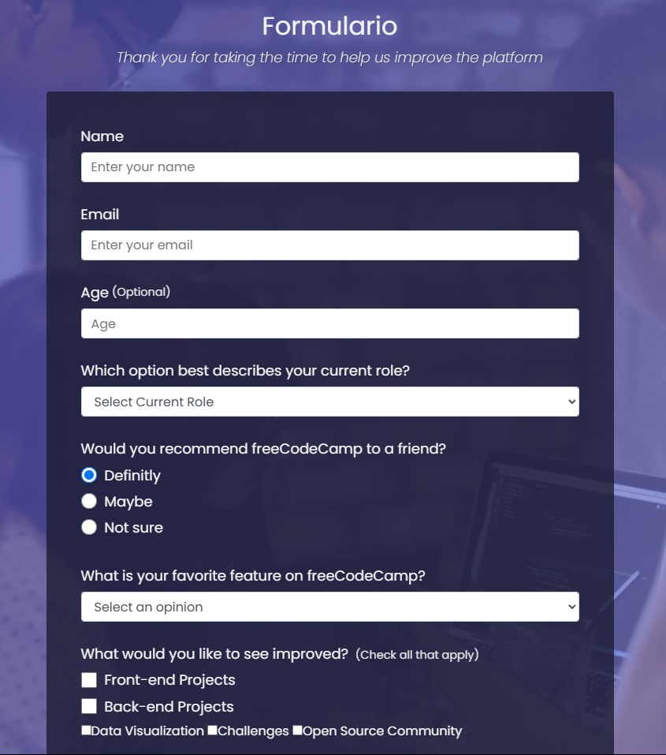

# 📋 Survey Form

A clean and responsive **Survey Form** built with pure **HTML & CSS**.  
Perfect for collecting user feedback in a structured and accessible format! ✨

---

## 🧩 Features

- ✅ Accessible form with required fields and labels
- ✏️ Text inputs for name, email, and age
- 🔘 Radio buttons for recommendations
- ✅ Checkboxes for multi-option feedback
- 🔽 Dropdown menus for role and feature preferences
- 📱 Responsive layout (mobile-friendly)

---

## 📸 Preview



---

## 🧠 Technologies Used

- HTML5
- CSS3 (custom classes and layout)
- Form controls (text, radio, checkbox, select)

---

## 🚀 How to Use

1. **Clone the repo**
   ```bash
   git clone https://github.com/AdesKitty01/survey-form.git
   cd survey-form
